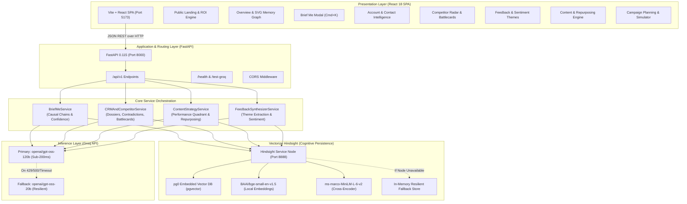
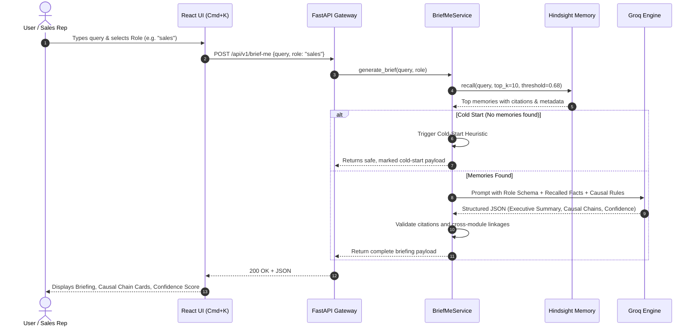

# Prelude Intelligence — System Architecture Specification

## 1. Architectural Philosophy & Vision

Enterprise revenue and product teams suffer from **Cross-Functional Context Amnesia**. When Sales completes an enterprise discovery call, Product has no visibility into committed features. When Customer Support handles repeated incident tickets, Account Executives walk into renewal negotiations blindsided. When competitors drop prices, Marketing campaigns take weeks to pivot.

**Prelude Intelligence** eliminates these organizational silos by introducing an **Autonomous Shared-Memory Intelligence Hub**. At its core, Prelude couples **Vectorize Hindsight** (a persistent cognitive memory substrate) with **Groq** (ultra-low-latency LLM inference), transforming disjointed events into an evolving, actionable knowledge graph.

---

## 2. High-Level Component Topology

---

## 3. Deep Dive: Memory Layer (Vectorize Hindsight)

Unlike standard retrieval-augmented generation (RAG) that searches static documents, **Vectorize Hindsight** treats memory as an evolving, self-refining cognitive graph.

### 3.1 Memory Partitioning & Bank Schema
All Prelude observations reside within the memory bank `marketing-product-hub`. Memories are categorized by operational modules:

| Module Identifier | Ingested Signals | Key Extraction Entities |
| :--- | :--- | :--- |
| `meeting_prep` / `crm` | Sales transcripts, executive 1-on-1s, renewal objections | Account Names, Budget Caps, Decision Makers |
| `feedback_synthesis` | Zendesk tickets, Slack bug reports, NPS comments | Pain Points, Feature Requests, Latency Complaints |
| `competitive_intel` | Press releases, pricing page diffs, teardowns | Competitor Names, Tier Discounts, Feature Gaps |
| `content_strategy` | Blog performance, conversion metrics, social shares | Topics, Channels, Audience Persona, ROI |
| `correction` | User overrides and executive ground-truth assertions | Entity, Invalidated Claim, Fresh Ground Truth |

### 3.2 Dual-Stage Memory Operations

#### Ingestion (`retain`)
When an event is captured:
1. **Entity & Observation Decomposition**: The raw narrative is parsed by Hindsight's extraction agent into atomic factual assertions.
2. **Dense Vector Indexing**: Facts are embedded using `BAAI/bge-small-en-v1.5` and stored alongside structured tags (`module`, `entity`, `source`, `timestamp`).
3. **Graph Linking**: Observations linking to existing known entities (e.g. `Acme Corp`, `ApexCloud`) create relational edges in the underlying `pg0` relational store.

#### Retrieval (`recall`)
When answering a query or constructing a dossier:
1. **Semantic Broad Search**: A vector similarity search identifies top candidate memory chunks across all modules.
2. **Cross-Encoder Reranking**: Candidate passages are reranked using `ms-marco-MiniLM-L-6-v2` against the role-specific inquiry.
3. **Provenance Attribution**: Each returned observation retains a deterministic citation ID (e.g. `mem_seed_49b1`) enabling end-to-end verification.

---

## 4. Cross-Module Intelligence Synthesis (`/brief-me`)

The `/api/v1/brief-me` endpoint is the flagship cognitive reasoning pipeline:

### 4.1 Causal Chain Detection
Standard LLMs produce isolated bullet points. Prelude's prompt contract forces the inference engine to construct verified **Causal Chains**:
$$\text{Cause Event} \xrightarrow{\text{Plausibility Reasoning}} \text{Effect / Strategic Impact}$$
*Example:* `ApexCloud 20% discount on Sept 15` $\rightarrow$ `Sarah Chen demands $80k price-match on Sept 18` $\rightarrow$ `High churn hazard if combined with unaddressed CSV export timeout tickets`.

### 4.2 Departmental Contradiction Radar
In `backend/services/crm_service.py`, Prelude actively scans memory vectors across contrasting modules to identify organizational blindspots:
- **Sales Stance**: *"Customer stated budget is capped strictly at $80,000."*
- **DevOps/Engineering Stance**: *"DevOps team requested infrastructure specs for a $140,000 multi-cluster rollout."*
- **The System Alert**: Flags a critical divergence, providing the account executive with the exact talk-track to capture the expansion revenue without offending the economic buyer.

---

## 5. Resilience & Fault Tolerance Strategy

| Failure Scenario | Mitigation Mechanism |
| :--- | :--- |
| **Groq API Rate Limit (429) or Timeout** | Automatic fallback from `openai/gpt-oss-120b` to secondary `openai/gpt-oss-20b` or `qwen/qwen3-32b` with exponential backoff (max 2 retries). |
| **Local Hindsight Daemon Offline** | `HindsightClient` automatically falls back to an internal high-fidelity mock memory repository, ensuring zero frontend crashes during demos. |
| **LLM Output Malformed JSON** | Robust multi-regex JSON extraction (`extract_json_from_response`) strips Markdown code fences and parses nested payloads safely. |
| **Network Partition / Client Offline** | Frontend features an instant Live/Mock toggle in the top navigation bar to seamlessly simulate live backend responses. |

---

## 6. Security, Provenance, & Data Governance

1. **Deterministic Citations**: Every bullet point in an executive summary or battlecard maps to one or more verified memory node IDs.
2. **User Ground-Truth Invalidation (`/correction`)**: If a team member submits a correction (e.g. *"Acme Corp renewed early on Sept 25th"*), a priority observation tagged `module: correction` is written to Hindsight. Future recalls prioritize the correction over superseded historical notes.
3. **Stateless Edge Inference**: User queries and credentials remain within your controlled VPC/container environment. LLM calls utilize encrypted HTTPS payloads with ephemeral context windows.
