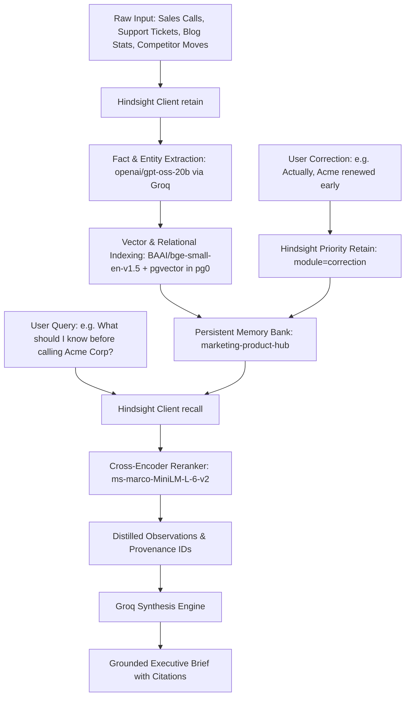

# Technical Submission Deliverable: How Hindsight Memory is Used

> **Submission Requirement:** Clear explanation of how Hindsight memory is used in your solution and why persistent memory is central to the value proposition.

---

## 1. Executive Summary

Traditional AI chatbots treat every interaction as an isolated session. In cross-functional business operations (Marketing, Product, Sales), this amnesia leads to siloed decisions, repeated mistakes, and fragmented context.

Our **Marketing & Product Intelligence Hub** utilizes **Hindsight (Vectorize)** as a shared, persistent cognitive memory substrate. Rather than acting as a static vector database or dumb key-value cache, Hindsight functions as an **evolving memory graph** that:
- Retains factual observations from customer tickets, competitor shifts, and meeting notes.
- Extracts entities and updates cross-temporal connections.
- Semantically recalls relevant cross-domain insights to inform downstream decision-making.
- Allows user feedback to correct historical assumptions over time.

---

## 2. Core Memory Architecture

---

## 3. The Three Memory Operations in Our Solution

### A. `retain()`: Continuous Learning Without Re-Training
Whenever a new event occurs:
- A competitor cuts prices or launches a feature (`module: competitive_intel`)
- A sales meeting uncovers budget ceilings or objections (`module: meeting_prep`)
- An enterprise customer encounters a repeated bug (`module: feedback_synthesis`)
- A content piece achieves high conversion (`module: content_strategy`)

The agent calls `retain()` with structured metadata tags. Hindsight decomposes the narrative into atomic observations, extracts canonical entities (e.g. `Acme Corp`, `ApexCloud`), and establishes vector embeddings with `bge-small-en-v1.5`.

### B. `recall()`: Cross-Silo Semantic Synthesis
When a user queries `/api/v1/brief-me`, our backend issues an unrestricted semantic `recall()` across the entire bank. 

Hindsight matches meaning rather than mere keywords, returning observations from disparate business functions. For instance, when asking about Acme Corp's pricing, Hindsight recalls:
1. *Sales notes* detailing Acme's $80k budget cap.
2. *Competitor alerts* revealing ApexCloud's 20% price cut 3 days prior.
3. *Support tickets* documenting that Acme's billing CSV exports are timing out.

The LLM connects these dots into a cohesive causal chain: *ApexCloud's aggressive pricing is giving Acme leverage, while internal billing export bugs are worsening client frustration.*

### C. `reflect()` & The Self-Correction Loop
If an account executive spots outdated information, they submit a correction via `/api/v1/correction`. This retains a verified correction memory into Hindsight. 

During subsequent recalls, Hindsight surfaces this correction with high truth precedence, ensuring the agent adapts and never repeats the refuted statement.

---

## 4. Why Memory is the Star, Not a Feature

| Without Hindsight (Stateless AI) | With Hindsight (Memory-Powered Agent) |
|---|---|
| Answers with generic textbook advice on pricing and negotiations. | Cites exact historical budget caps, previous commitments, and dates. |
| Cannot connect customer complaints to competitor pricing shifts. | Synthesizes causal chains across 4 business modules simultaneously. |
| Repeats identical suggestions after being corrected by a human. | Dynamically adapts following user corrections via the feedback loop. |
| Hallucinates plausible-sounding but fictitious histories on cold starts. | Explicitly detects zero historical data and declares a cold start. |
