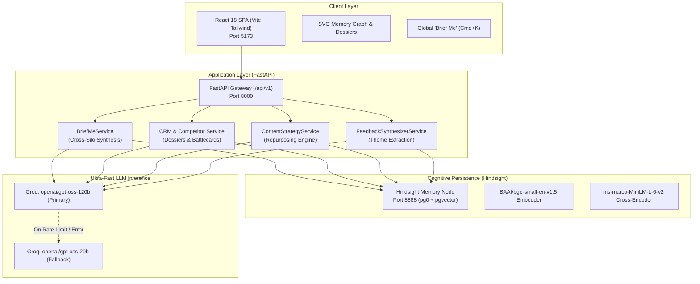

# Prelude Intelligence — Documentation Hub

Welcome to the comprehensive documentation library for **Prelude Intelligence**, an enterprise cross-functional shared-memory intelligence platform powered by **Vectorize Hindsight** and **Groq** ultra-fast LLM inference.

---

## 🗺️ Documentation Directory

| Document | Purpose | Target Audience |
| :--- | :--- | :--- |
| **[Architecture Guide](file:///c:/Users/Nikhil%20Chandra/hackmicro/docs/ARCHITECTURE.md)** | Full-stack system architecture, data flows, Hindsight memory mechanics, and Groq inference topology. | Architects, Engineers, Evaluators |
| **[User Guide & Tour](file:///c:/Users/Nikhil%20Chandra/hackmicro/docs/USER_GUIDE.md)** | Step-by-step walkthrough of every dashboard, module, battlecard, and interactive feature. | End Users, Sales, Product, Evaluators |
| **[Developer Guide](file:///c:/Users/Nikhil%20Chandra/hackmicro/docs/DEVELOPER_GUIDE.md)** | Developer onboarding, local workspace setup, code structure, testing workflows, and contributing. | Backend & Frontend Developers |
| **[Deployment Guide](file:///c:/Users/Nikhil%20Chandra/hackmicro/docs/DEPLOYMENT_GUIDE.md)** | Local execution, Docker Compose orchestration, Cloud deployment (GCP/AWS/VPS), and environment configuration. | DevOps, SREs, System Admins |
| **[API Contract Specification](file:///c:/Users/Nikhil%20Chandra/hackmicro/docs/API_CONTRACT.md)** | Detailed REST schemas, request/response models, and status codes for all endpoints. | API Consumers, Integrators |
| **[Hindsight Memory Mechanics](file:///c:/Users/Nikhil%20Chandra/hackmicro/docs/HINDSIGHT_EXPLANATION.md)** | Deep technical dive on how Vectorize Hindsight transforms institutional data into evolving memory graphs. | AI Engineers, Hackathon Judges |
| **[Technical Write-up Article](file:///c:/Users/Nikhil%20Chandra/hackmicro/docs/TECHNICAL_ARTICLE.md)** | Full 1,200-word deep-dive article on enterprise context amnesia, architecture, and memory paradigms. | Hackathon Judges, Readers, Evaluators |

---

## 🌟 System High-Level Topology

---

## ⚡ Quick Access Links

- **Interactive API Swagger**: [http://127.0.0.1:8000/docs](http://127.0.0.1:8000/docs)
- **Local Application Hub**: [http://localhost:5173](http://localhost:5173)
- **Primary Configuration**: [.env](file:///c:/Users/Nikhil%20Chandra/hackmicro/.env)
- **Automated Test Suite**: [tests/](file:///c:/Users/Nikhil%20Chandra/hackmicro/tests)
